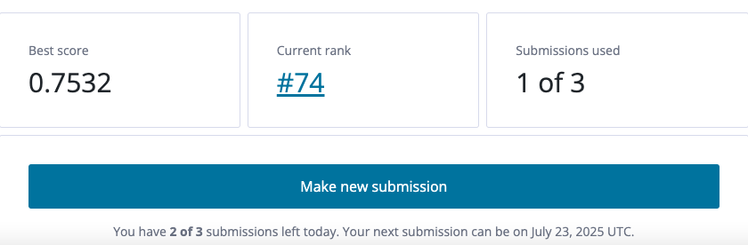

# Richter-s-Predictor-Modeling-Earthquake-Damage



Questo progetto affronta il problema della classificazione del grado di danno agli edifici a seguito di un terremoto, basandosi su dati strutturali, geologici e sociali.

La pipeline è organizzata modularmente in 4 notebook principali, più 2 notebook dedicati alle varianti del modello con RandomForest e LightGBM ottimizzati tramite Nested Cross-Validation.

---

## Descrizione del progetto

Questo progetto si concentra sulla classificazione supervisionata utilizzando due modelli principali:

- **Random Forest** (con Randomized Search)
- **LightGBM** (con ottimizzazione tramite Optuna)

Per garantire una valutazione robusta ed evitare overfitting durante il tuning, viene adottata una strategia di **Nested Cross-Validation (5×3)**:
- **5-fold esterni** per valutare la generalizzazione
- **3-fold interni** per selezionare i migliori iperparametri

Il modello finale viene selezionato sulla base della **media della metrica F1-micro** calcolata sui 5 fold esterni.

---

## Istruzioni per l’esecuzione

### 1. Requisiti

Installa le dipendenze richieste:

```bash
pip install -r requirements.txt
```
### 2. Avvio dei notebook

Esegui Jupyter Notebook e apri i file:

```bash
jupyter notebook
```
---

## Struttura dei file

| File                            | Descrizione                                                                 |
|--------------------------------|-----------------------------------------------------------------------------|
| `main.ipynb`                   | Coordinamento dei passaggi principali                                       |
| `preprocessing.ipynb`         | Pulizia, imputazione, scalatura, feature engineering                        |
| `models.ipynb`                | Setup dei modelli (RandomForest, LightGBM)                                  |
| `metrics.ipynb`               | Calcolo delle metriche: F1, precision, recall, confusion matrix             |
| `rf_random_search_nested_cv.ipynb` | Nested CV con Random Search su Random Forest                          |
| `lgbm_random_search_nested_cv.ipynb` | Nested CV con Optuna su LightGBM                                     |

---

## Nested Cross-Validation (5×3)

La nested cross-validation prevede:
- 5 fold **esterni**: valutazione della capacità di generalizzazione del modello
- 3 fold **interni**: tuning degli iperparametri tramite RandomizedSearch (RandomForest) o Optuna (LightGBM)

Per ogni fold esterno:
1. Viene eseguita una ricerca degli iperparametri migliore sui fold interni
2. Il modello viene allenato con i migliori parametri e valutato sul fold esterno
3. Le metriche vengono memorizzate

Al termine, si calcola la **media delle metriche sui 5 fold esterni**.

---

## Come interpretare i risultati

Durante l'esecuzione vengono stampati:
- **F1-micro** per ogni fold esterno
- **Media e deviazione standard F1-micro**
- Altre metriche aggregate (accuracy, precision, recall, macro-F1)

Questi risultati sono utili per confrontare le performance dei diversi modelli e identificare la configurazione ottimale.

---

## Conclusione sul piazzamento 

Il progetto ha ottenuto un buon piazzamento nella leaderboard del contest, come mostrato nell'immagine in alto.

